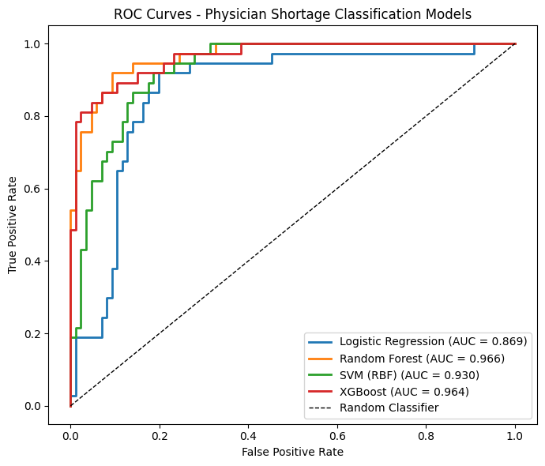
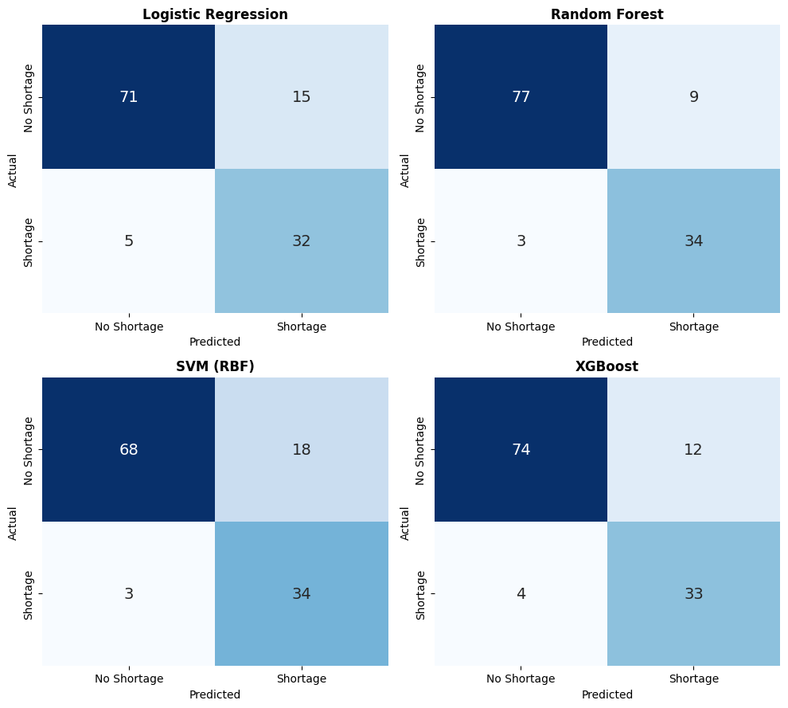
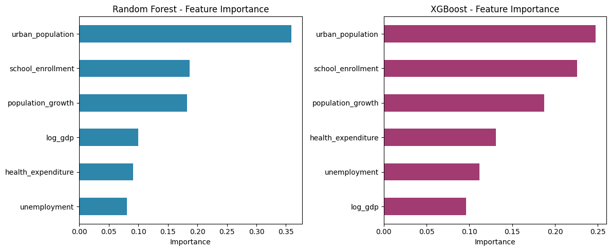
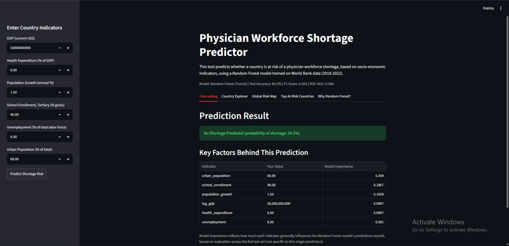
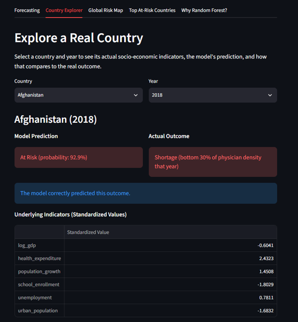
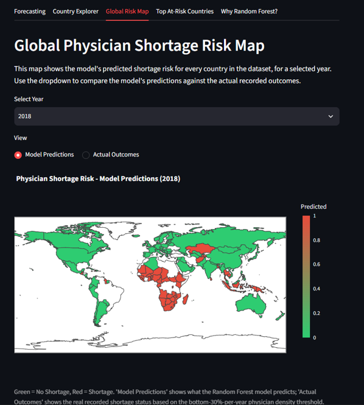
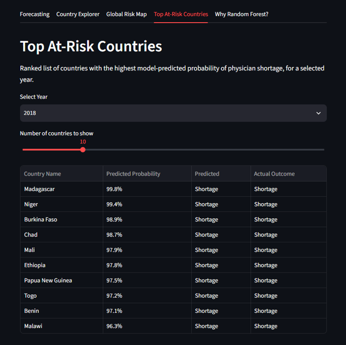
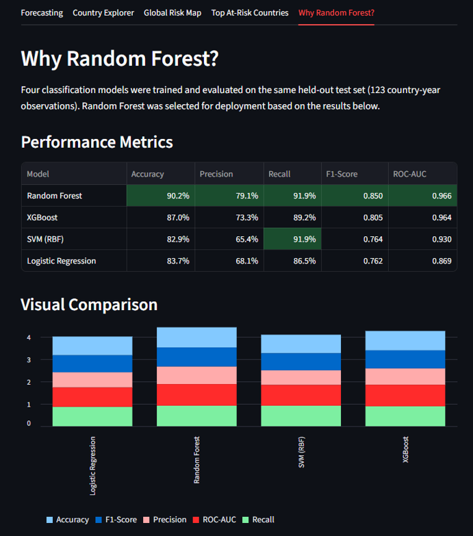
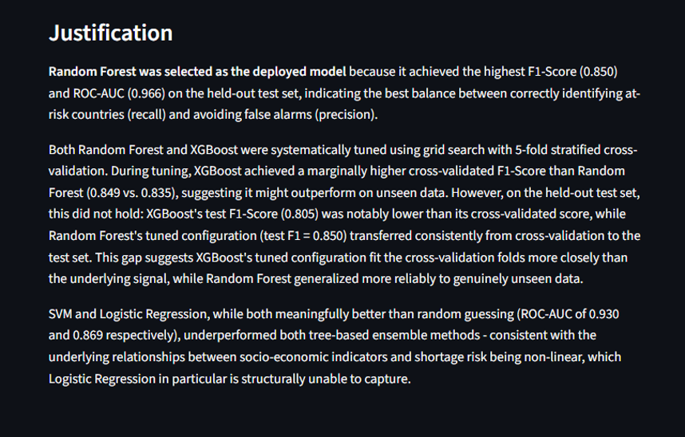

# Predicting Physician Workforce Shortages

An end-to-end machine learning project that identifies countries at risk of physician workforce shortages from socio-economic and health-system indicators.

The analysis combines World Bank data for **159 countries** across **2018–2022**, compares four classification models, and translates the results into decision-ready insights for health workforce planning.



## The question

Can publicly available development indicators help identify countries likely to fall into the lowest 30% of physician density in a given year?

I framed this as a binary classification problem:

- **Shortage:** physician density is in the bottom 30% for that year.
- **No shortage:** physician density is above that threshold.

The model uses six predictors: log GDP, health expenditure, population growth, tertiary school enrolment, unemployment, and urban population.

## Results

Random Forest produced the strongest balance of discrimination and shortage-case detection on the held-out test set.

| Model | Accuracy | Precision | Recall | F1 | ROC-AUC |
|---|---:|---:|---:|---:|---:|
| **Random Forest** | **90.2%** | **79.1%** | **91.9%** | **0.850** | **0.966** |
| XGBoost | 87.0% | 73.3% | 89.2% | 0.805 | 0.964 |
| SVM (RBF) | 82.9% | 65.4% | 91.9% | 0.764 | 0.930 |
| Logistic Regression | 83.7% | 68.1% | 86.5% | 0.762 | 0.869 |

The tuned Random Forest identified **34 of 37 shortage cases**, with 3 false negatives and 9 false positives.



## What mattered

Urban population, tertiary school enrolment, and population growth were the most influential Random Forest signals. Feature importance indicates predictive contribution, not causality; these findings are best used for prioritising further investigation.



## Interactive Streamlit app

`app.py` turns the analysis into an interactive decision-support tool. It includes:

- Manual shortage-risk forecasting from six socio-economic indicators.
- Country and year exploration against recorded outcomes.
- A global predicted-risk map.
- Rankings of the highest-risk countries by year.
- A transparent comparison of all four evaluated models.

The repository includes the fitted scaler and all four trained model artifacts. The app deploys the tuned Random Forest because it achieved the strongest held-out F1-score and ROC-AUC.

```bash
streamlit run app.py
```

### App walkthrough

| Forecasting | Country explorer |
|---|---|
|  |  |

| Global risk map | At-risk ranking |
|---|---|
|  |  |

| Model comparison | Selection rationale |
|---|---|
|  |  |

## Workflow

1. Explored and aligned seven World Bank indicators.
2. Built a pooled country-year dataset for 2018–2022.
3. Defined a year-relative shortage target to avoid a single global threshold.
4. Applied transformations and feature scaling where appropriate.
5. Used a stratified 80/20 train/test split with a fixed random seed.
6. Compared Logistic Regression, Random Forest, SVM, and XGBoost.
7. Tuned the tree ensembles with stratified 5-fold cross-validation using F1 score.
8. Evaluated accuracy, precision, recall, F1, ROC-AUC, learning curves, and country-level errors.

## Repository guide

```text
app.py                       # interactive Streamlit application
notebooks/
  01_exploration.ipynb
  02_2022_preparation.ipynb
  03_pooled_preparation.ipynb
  04_model_building.ipynb
  05_model_evaluation.ipynb
data/
  final_dataset_model_ready.csv
outputs/
  figures/                 # model diagnostics and interpretation charts
  tables/                  # metrics, predictions, and error analysis
  X_train.csv, X_test.csv  # reproducible split supplied with the project
  y_test.csv
models/                    # fitted scaler and four trained classifiers
```

The processed modelling dataset is included, so the project can be reproduced from `04_model_building.ipynb` onward. The first three notebooks document the raw-data exploration and preparation workflow; see [data/README.md](data/README.md) for the expected source files.

## Run locally

Tested with Python 3.11.

```bash
python -m venv .venv
source .venv/bin/activate        # Windows: .venv\Scripts\activate
pip install -r requirements.txt
jupyter lab
```

Run `04_model_building.ipynb` before `05_model_evaluation.ipynb`. The first notebook generates the trained model files used by the evaluation notebook.

To launch the included interactive application after installing the requirements:

```bash
streamlit run app.py
```

## Limitations

- The target is a relative risk flag, not a clinical or policy definition of an adequate physician workforce.
- Country-year rows are pooled, so temporal and country-level dependence may make a random hold-out split optimistic.
- World Bank indicators contain missing values and cross-country measurement differences.
- Feature importance and logistic coefficients describe model behaviour; they do not establish causal effects.

A stronger production study would add grouped or out-of-time validation, uncertainty estimates, refreshed source data, and review by health-workforce experts.

## Author

**Adam Mohamed Eldaleel**

[GitHub](https://github.com/Eldaleel) · [LinkedIn](https://www.linkedin.com/in/adam-eldaleel-874340353)
